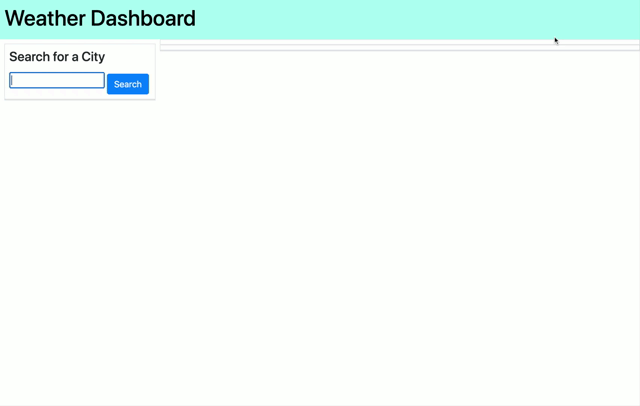

# Weather Dashboard

## purpose
The weather dashboard application allows users to search for the weather outlook in different citites. When a user inputs a valid city entry they are presented with current and future weather conidtions and the city is added to the search history. The user is presented with weather conditions, temperature, humidity, wind speed, and the UV index or searched up city.

## Built With
* html
* css
* javascript
* jquery
* bootstrap
* open weather api

## Github URL
https://github.com/Araceli4690/Weather-Dashboard.git

## Website URL
https://araceli4690.github.io/Weather-Dashboard/